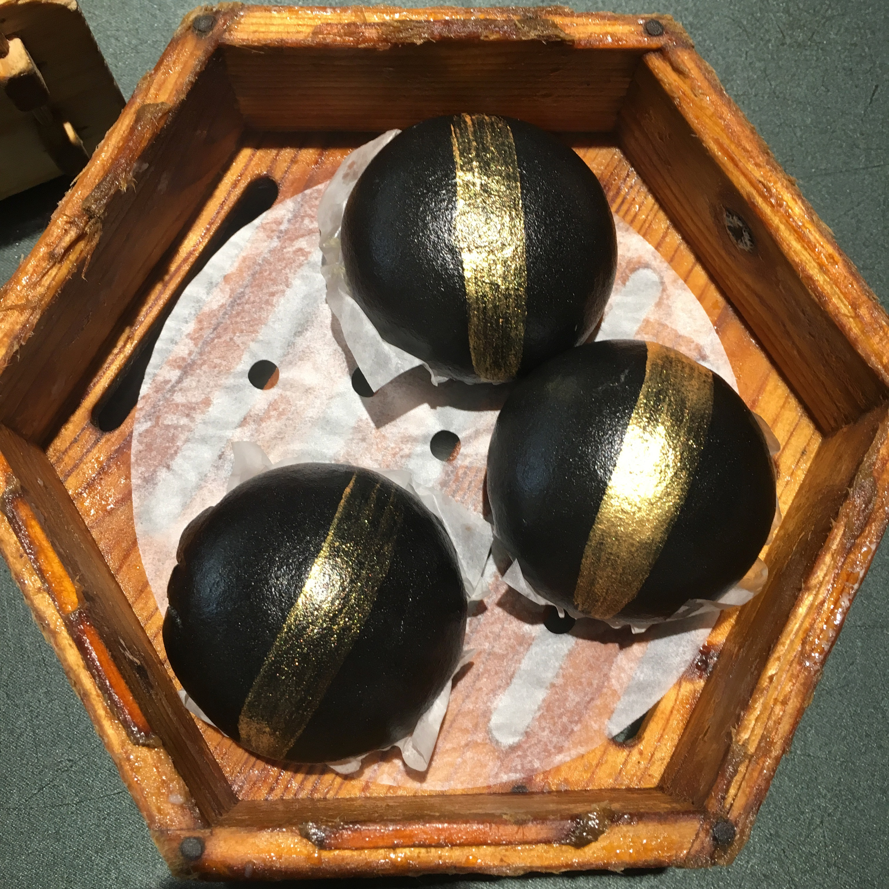
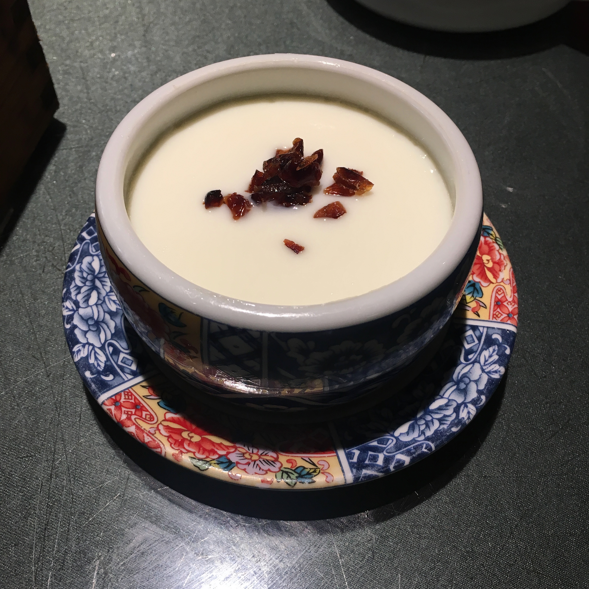
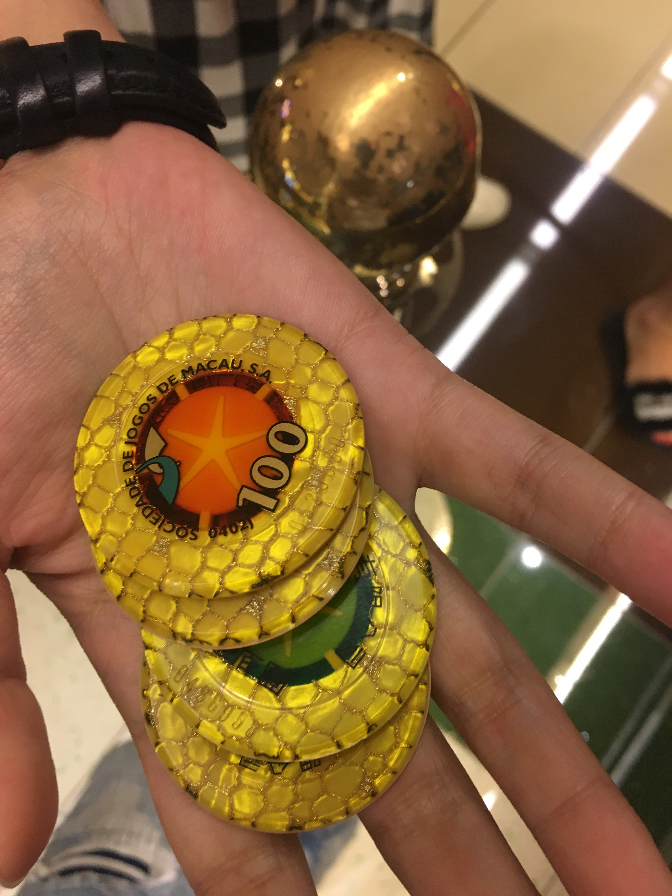
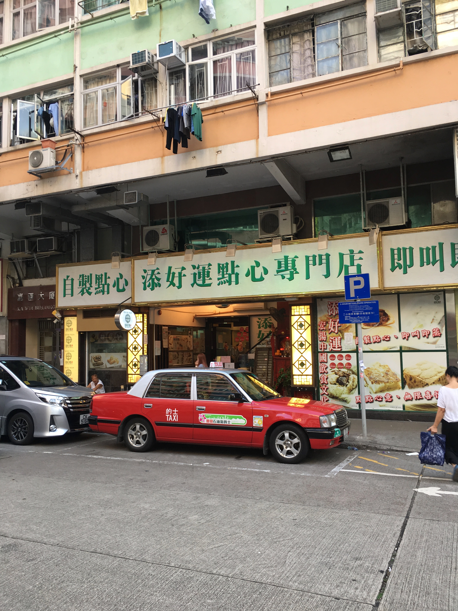
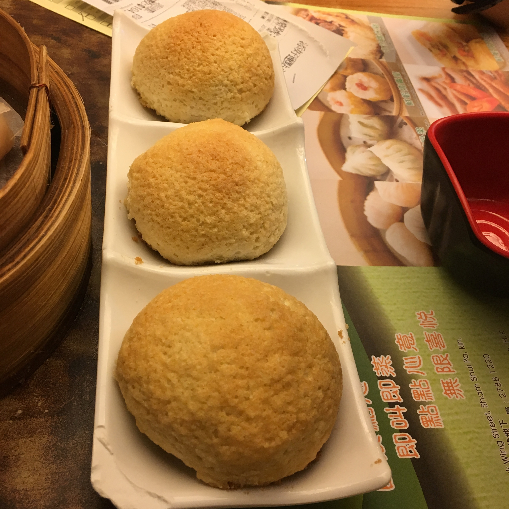
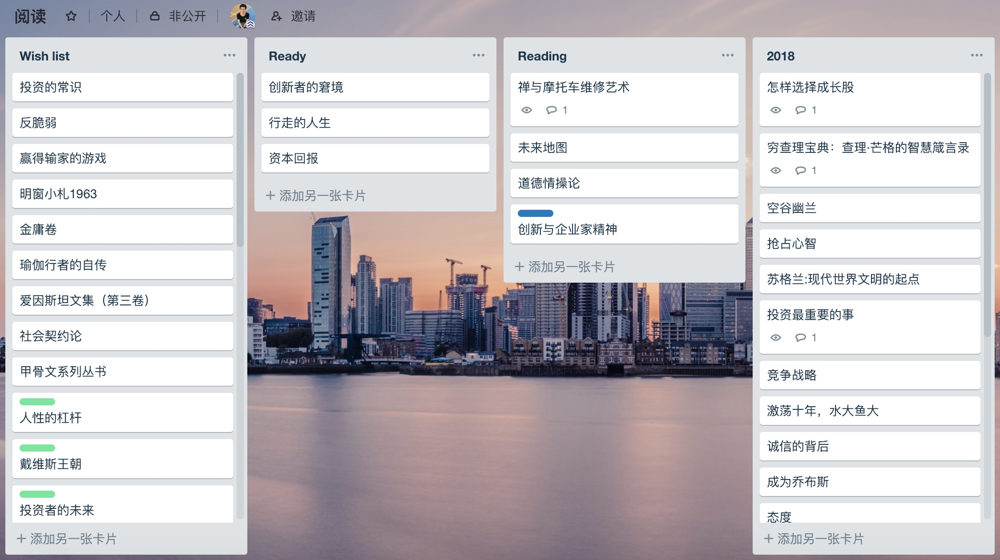

# 2018

2018年终于换工作了，从2016年开始就一直为工作的事情焦虑。而今年终于有勇气作出改变，也许本来就没有完美的工作，唯一能保证的就是自己不断地学习。

2018年5月21日，入职新公司。换工作中间都没怎么休息，只有一个周末，现在回想估计我也是停不下来的，休息着可能会更焦虑。后来的几个月，换工作并没有让我觉得心态转变。而是持续数月的低质量睡觉。那是绝对令人绝望的日子。虽然自己尝试着和周围的人聊天，看各种书、《哈佛幸福课》、《正念禅修》可始终无法自洽。后来6月底开始去看医生，医生开了助眠的药，还有抗焦虑。终于睡觉质量好多了，人的心态也积极了很多，很庆幸选择专业的人帮我解决，我真的没法自己处理了。也感觉到这些心理上的困难，旁人终究无法理解，除非亲身经历。

8月初，还去做了一次昂贵的心理咨询，1500/次。这大概是我这些年来最奢侈的一笔消费了(不是指金额数量)。第一次咨询，我能感觉到咨询师经验比较丰富，也能很快梳理出我的原因所在，并给出了一些建议。
建议我设立目标，而不是一直毫无止境的奔跑。这一点倒是我所忽视的。当我表示毕业后这几年的周末，我几乎都是在图书馆度过。咨询师表示惊讶，这年头居然还有你这样的人。。。
不过还是只能靠自己去想通，咨询也能引导，考虑到价格因素，后来就没有第二次了。。

关于新工作，主要涉及机器学习部分，风控业务，虽然以前没干过，还是很令人兴奋的，总是需要不断学到新东西，我才会不那么焦虑。也干了不少杂活，写了不少sql。

7-8月份的时候，抽空还在kaggle上找了个题目，超预期冲到TOP10%了，虽然不是TOP10～哈哈哈😂～
不过收获也蛮大的，虽然看起来都是体力活，一点一点做特征工程，模型调优。因为数据过大的原因，租了阿里云主机，刚开始选个低配的，后来发现完全不够用，慢慢加到64G的配置，价格也是飙升，我只能按照小时收费，本地小样本测试，全量数据上阿里云。

这么焦虑，其实今年应该多出去玩耍的，不过因为实在是现金流不给力，购置家具之类的，都没钱玩耍了，真是惭愧。

5月份去潮汕狂吃几天；潮汕美食真心吃不过来，还超好吃，一天4-5顿。感觉以前吃的港式，广式是假的~🐶

10月假期去了广州，香港，澳门，依然是深度老年逛吃游。
第一次去香港，给我的感觉：

道路好窄，但车速好快；

电梯好快，一不小心感觉要摔倒了；

工资挺高的，不过房价也是令人窒息；

真的适合购物，适合买买买；

奢侈品店都是人满为患，感觉大陆游客好有钱；

不过吃到了米其林三星，而且价格超级亲民，真是惊喜呢！

在澳门当了一回赌徒，在赌场赢了200块。可惜回来的时候被的哥宰价了～

关于阅读。

感觉今年阅读质量有了很大的提升，无论是阅读速度，还是阅读效率。依然会成系统地看某个领域的书，每本书也许都是带着某种期许在看，感觉非常有针对性，也偶尔体会到碎片连在一起的美好体验。总的来说阅读范围依然是围绕着人文社科，人性与历史领域。

有些是旧书重读，有些是短篇文章。读《富兰克林自传》，深深为其人格所折服，富兰克林从小只上过几年学，就开始当蜡烛工，印刷工；却抓住所有的阅读机会。并为自己设立修身立德计划，列出13项品德，一周检查一项，十三周完成一轮，一年循环四次，不断强化，令人惊叹。坚持一生，不断学习，不断总结自己的过失并改正。很多书评会提到，富兰克林就像是一个普普通通的平凡人在讲自己的故事；可是做到如此严苛的个人品格追求，并在众多领域有所建树，又岂是平凡人。毕竟可是查理芒格的偶像！13种品德，举其一二，勤奋、节俭，做到者寥寥。**始终相信某种程度的物质财富，是伟大人格的副产品**。

《传习录》，第一次了解王阳明心学，重新认识何为知行合一，简直是完美的思想观。后来再读读《道德经》、《孙子兵法》，再次体会到道家哲学的博大精深，古人已经总结了非常棒的处世哲学，哪怕再过千年仍不过时。深刻的辩证思想，宏大的宇宙观，以后有了更多人生经历，再次翻阅应该会有不同的感受。以前看不懂西方哲学，古老的东方哲学思想，倒是让我受益良多呢。

* 《如何有效阅读一本书》
* 《手把手教你读财报》
* 《跳着踢踏舞去上班》
* 《查理芒格的原则》
* 《富兰克林自传》
* 《原则》
* 《崩溃》
* 《先发影响力》
* 《基因组：人类自传》
* 《国富国穷》
* 《哈佛幸福课》
* 《正念禅修》
* 《精力管理》
* 《不落俗套的成功》
* 《巴菲特致股东的信》
* 《历史的教训》
* 《投资中不简单的事》
* 《3G资本帝国》
* 《智能革命》
* 《共同基金常识》
* 《必然》
* 《传习录》
* 《彼得林奇的成功投资》
* 《谈判力》
* 《生命3.0》
* 《伟大的博弈》
* 《生活十讲》
* 《今日简史》
* 《禅与摩托车维修艺术》
* 《新乔布斯、禅与投资》
* 《怎样选择成长股》
* 《穷查理宝典：查理·芒格的智慧箴言录》
* 《空谷幽兰》
* 《苏格兰：现代世界文明的起点》
* 《抢占心智》
* 《投资最重要的事》
* 《竞争战略》
* 《诚信的背后》
* 《竞争优势》
* 《激荡十年，水大鱼大》
* 《成为乔布斯》
* 《态度》
* 《变革中国》
* 《硅谷来信》
* 《腾讯传》
* 《社会动物》
* 《道德经》
* 《孙子兵法》
* 《道德情操论》
* 《品格之路》
* 《钝感力》
* 《创新与企业家精神》

目前还是在用Evernote作阅读笔记，阅读的书单开始用Trello来管理，真是超级棒！
Trello，本来是用于项目管理之类的，其实用在标的持续跟踪也挺好的。

新的一年，新的todo还没写好。

希望能平衡好生活和工作，这一点我一直都做的不好。

希望好好陪伴家人。

希望依然能有积极的心态，抱着终身学习的理念，对人性的理解与克制，坚定地扛住资本复利的武器。

