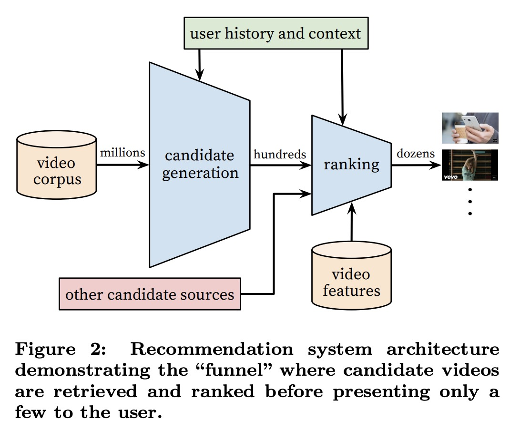
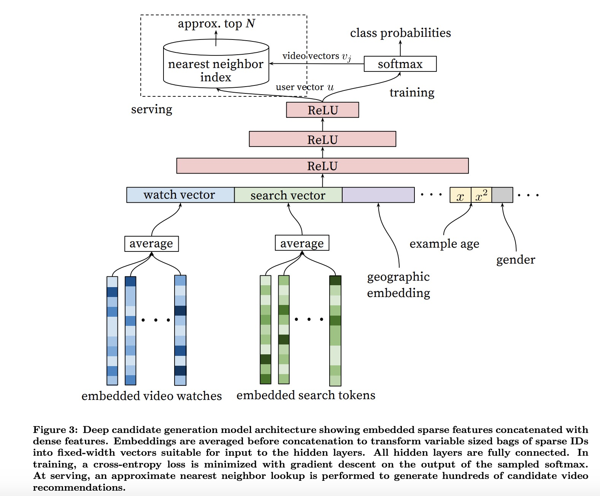
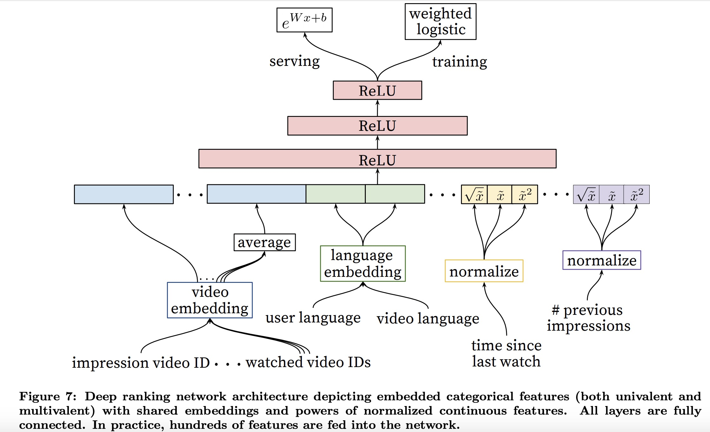

## Deep Neural Networks for YouTube Recommendations

YouTube 视频推荐论文。

### SYSTEM OVERVIEW

* candidate generation network
* ranking network

推荐系统主要分为2大部分，候选集生成网络，ranking网络；

**candidate generation**的输入主要是用户的历史行为数据，然后从视频语料集中筛选出部分视频。

主要是基于协同过滤的方式来选出候选集；用户之间的相似性，以历史观看记录，搜索记录作为主要的特征。

**ranking network** 在前一步的基础上，对候选集进行score，然后以score排序展现给用户。

### Model Architecture

受词向量思想的启发，作者把用户的视频浏览记录作为一个序列；好比一篇小短文，每个视频就是一个单词，以此来训练视频的 vector。将用户看过的视频向量，做个简单的average，效果也很不错；可以看下图，具体的**candidate generation**的网络结构

搜索记录也是类似的处理方式，转化为向量；
此外用户的个人信息也很重要，比如国籍，年龄，性别等。

在特征工程部分，还引入了视频的新鲜度；也就是刚上传的视频，更容易得到用户的关注，而被点击查看；

### RANKING

在产生候选集之后，就是ranking部分；
在考虑特征的时候，着重考虑视频自身的特征，以及和用户的相关性特征；
先看下具体的网络结构

这里很大篇幅讲到了特征工程部分；比如Categorical 特征，作者会做一个Embedding，比如性别，地区；而连续的特征通常是Normalizing；关于这一块也是漫游参考意义的。

论文里还提到一些有趣的发现，比如用户往往看剧集是按照顺序来的，因此预估用户下一个看的视频，比预估中间的效果会更好。

ranking阶段还考虑到场景的特征，比如也许用户对某个视频感兴趣，而仅仅因为不喜欢推荐首页的缩略图而放弃观看。

还有上文提到的，用户对新内容往往更加感兴趣，因此视频的上传时间特征也加入训练特征；并明显带来了提升。从产品角度来说，其实也是鼓励内容产生～

### REFERENCES

[Deep Neural Networks for YouTube Recommendations](https://static.googleusercontent.com/media/research.google.com/zh-CN//pubs/archive/45530.pdf)